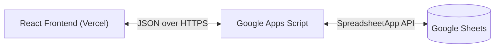

# Minted - Design Document

| Project | Minted |
| :--- | :--- |
| **Date** | 2026-02-13 |
| **Status** | Completed |
| **Author** | Antigravity |

## 1. Overview
The **Minted** is a personal finance management web application designed to track income and expenses. It features a responsive, premium UI with real-time data visualization. The system is built on a serverless architecture, utilizing Google Sheets as a database and Google Apps Script as the backend API.

## 2. Architecture
The system follows a 3-tier architecture:



### 2.1 Frontend (Presentation Layer)
-   **Framework**: React 18 with TypeScript.
-   **Build Tool**: Vite.
-   **Styling**: Vanilla CSS with CSS Variables for theming (Glassmorphism design).
-   **Routing**: React Router DOM (`/dashboard`, `/income`, `/expense`).
-   **State Management**: Local component state + React Hooks (`useState`, `useEffect`, `useMemo`).
-   **Visualization**: Recharts for data plotting.
-   **Animation**: Framer Motion for page transitions.

### 2.2 Backend (Logic Layer)
-   **Platform**: Google Apps Script (GAS).
-   **Deployment**: Web App (Executes as User, Access: Anyone).
-   **Endpoints**:
    -   `doPost(e)`: Accepts JSON payloads to append rows.
    -   `doGet(e)`: Returns all sheet data as JSON.
-   **Concurrency**: Uses `LockService` to prevent race conditions during simultaneous writes.

### 2.3 Database (Data Layer)
-   **Storage**: Google Sheets.
-   **Schema**:
    -   `Timestamp`: Auto-generated server-side.
    -   `Date`: ISO Date string from client.
    -   `Type`: 'Income' | 'Expense'.
    -   `Category`: String (Dropdown selection).
    -   `Amount`: Number.
    -   `Description`: String (Optional).

## 3. Component Design

### 3.1 Layout
-   **`Layout.tsx`**: The main shell. Contains the `Sidebar` navigation and the `Outlet` for page content. Handles responsive states (collapsing sidebar on mobile).

### 3.2 Pages
-   **`Dashboard.tsx`**:
    -   Fetches data on mount using `fetchTransactions()`.
    -   Calculates totals (Income, Expense, Balance) using `useMemo`.
    -   Aggregates data by date for the `AreaChart`.
-   **`Income.tsx` / `Expense.tsx`**: Wrapper pages that render the `TransactionForm` with a specific `type` prop.

### 3.3 Core Components
-   **`TransactionForm.tsx`**: A reusable form component.
    -   **Props**: `type` ('Income' | 'Expense').
    -   **Validation**: Prevents empty fields or negative amounts.
    -   **Feedback**: Displays success/error messages based on API response.

### 3.4 Services
-   **`api.ts`**:
    -   `submitTransaction(data)`: Sends POST request.
    -   `fetchTransactions()`: Sends GET request and parses JSON.
    -   **Config**: Uses `import.meta.env.VITE_GOOGLE_APPS_SCRIPT_URL`.

## 4. Security & Deployment

### 4.1 Authentication
-   **Backend**: The GAS Web App is deployed with "Who has access: Anyone". This allows the frontend (hosted anywhere) to communicate without OAuth complexity, suitable for a personal project where the URL is kept secret (Security by Obscurity).
-   **CORS**: `doGet` requests run standard CORS checks. `doPost` requests use `mode: 'no-cors'` (opaque response) to bypass browser strictness on Google's redirects, typically treated as a fire-and-forget success in this architecture.

### 4.2 Hosting
-   **Frontend**: Deployed on **Vercel** for global edge caching and automatic SSL.
-   **Environment Variables**: The backend URL is stored securely in Vercel's project settings, not hardcoded in the repository.

## 5. Directory Structure
```
src/
├── assets/
├── components/
│   ├── forms/
│   │   ├── TransactionForm.tsx  # Core data entry
│   │   └── TransactionForm.css
│   └── layout/
│       ├── Layout.tsx           # App shell & Nav
│       └── Layout.css
├── pages/
│   ├── Dashboard.tsx            # Data visualization
│   ├── Income.tsx
│   └── Expense.tsx
├── services/
│   └── api.ts                   # Fetch/Post logic
├── App.tsx                      # Routes configuration
├── main.tsx                     # Entry point
└── index.css                    # Global vars & reset
```
